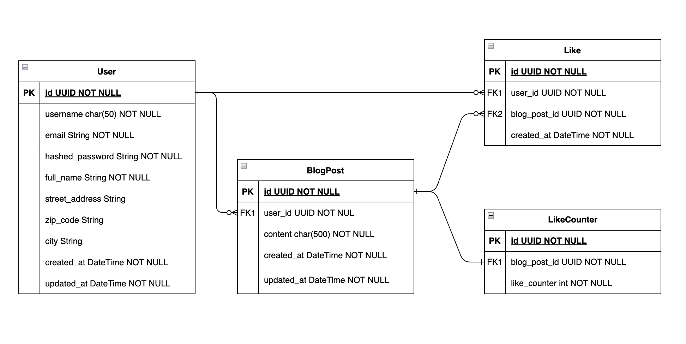

# Mini-X

## Project State

Fun Project

## Project Type

Python 3.11

## Maintainers

Abdulrahman Alshawakri <[abdulrahman.alshawakri@gmail.com](mailto:abdulrahman.alshawakri@gmail.com?subject=Issue%20at%20minix)>

## Developers

Abdulrahman Alshawakri <[abdulrahman.alshawakri@gmail.com](mailto:abdulrahman.alshawakri@adobe.com?subject=Issue%20at%20minix)>

## Overview

We all hate that you have to pay to edit your post in X, mini-x solves it for us. This project aims to design a mini blog like X and make it truly open source.


## Database Design


The system currently consist of the User and BlogPost tables, Like and LikeCounter are to be implemented.

* We use UUID for our all primary keys to ensure uniqueness across distributed servers.
* Location is divided into the main categories, street_address, zip_code, and city, to ease querying and creating aggregates based on any of the fields.
* DateTime objects of created_at, updated_at across all the tables should be in UTC.
* LikeCounter exists to avoid making count aggregate everytime we want to display the number of likes.

## Packaging
* alembic: Contains all the database schema migration scripts, when you create a model import it in the env.py file.
* api: Contains all routers and their schema models. (Router layer)
* authentication: Contains all the logic related to authenticate a user and generate passwords.
* infra: Contains all the infrastructure related dependencies and their setup. All future infra dependencies should be there.
* repositories: Is the data access layer of the system and contain the logic of interacting with the infrastructure (DB), this is the closest layer to the infrastructure and future dependencies interacting with infra should be in here.
* service: This where the business logic should fall into as it connects the router layer with data access layer.
* settings: Contains all server configurations related to the environment variables.

## Setup

### PyEnv installation

* Install `pyenv` following the instruction https://github.com/pyenv/pyenv
    * `pyenv` is python version management system to easily work in different python versions
* Execute ```pyenv install 3.11.5```
* In the current directory, set the python version. This creates the file .python-version.
  ```pyenv local 3.11.5```
* Validate via ```pyenv version```

### Poetry (v1.8.2) installation

Poetry is a packaging and dependency manager for python

* Follow the instruction in here https://python-poetry.org/docs/#installation
* Configure poetry to create virtual app.environments inside the project's root directory
  ```poetry config virtualenvs.in-project true```
* Create the virtual environment by executing ```poetry env use 3.11.5```
* Install dependencies by executing  ```poetry install``` (On MacOS sometimes you need to run it with sudo)

### Docker

Follow the instruction in https://docs.docker.com/desktop/ to install Docker desktop corresponding to the operating system used.

### Pre commit configuration

Pre commit at this stage will be installed as part of the dev dependencies therefore the hooks need to be installed
at `.git/hooks/pre-commit` by executing:
```shell 
poetry run pre-commit install
``` 
Then validate the installation by running the hooks over all the files by executing:
```shell
poetry run pre-commit run --all-files
```

## Run Mini-X

The app is runnable through docker compose by simply executing, you should expect first the run_migration stage to run first then the app server.

```shell
docker compose up --build -d
```

Then you can access the APIs directly at http://0.0.0.0:8000/docs

Currently, there are 3 groups created:

* Auth
  * POST /api/v1/auth/register -> Create a new user
  * POST /api/v1/auth/login -> Login with credentials
* Users
  * GET /api/v1/users/me -> Get logged in user profile 
  * PUT /api/v1/users/me -> Update logged-in user profile
* Blogs
  * POST /api/v1/blogs/posts/ -> Create a new post for the logged-in user
  * PUT /api/v1/blogs/posts/{post_id} -> Update a post for the logged-in user
  * DELETE /api/v1/blogs/posts/{post_id} -> Delete a certain post of the logged-in user
  * GET /api/v1/blogs/posts/{post_id} -> Public API to get a certain post from the blog
  * GET /api/v1/blogs/users/{user_id}/posts -> Public API to get the posts of a certain user

For running locally without docker:

* Run ```docker compose up --build -d run_migration```, this should start up the postgres server and migrate the schemas.
* From intellij PyCharm run, navigate to configuration in top left corner and run/debug main.
  * You can add/edit environment variables from there to what you see fit. (Please refer to .env.template file for the variables)


## Test with coverage

```shell
poetry run pytest .
```

Coverage report:

Not fully covered but hey, we try our best!

```shell
---------- coverage: platform darwin, python 3.11.5-final-0 ----------
Name                                      Stmts   Miss  Cover   Missing
-----------------------------------------------------------------------
mini_x/__init__.py                            0      0   100%
mini_x/api/__init__.py                        6      0   100%
mini_x/api/v1/__init__.py                     0      0   100%
mini_x/api/v1/dependancies.py                32     12    62%   24, 31, 37, 44, 51-63
mini_x/api/v1/models/__init__.py              0      0   100%
mini_x/api/v1/models/blog.py                 15      0   100%
mini_x/api/v1/models/user.py                 21      0   100%
mini_x/api/v1/routes/__init__.py              0      0   100%
mini_x/api/v1/routes/auth.py                 22      9    59%   20-24, 32-40
mini_x/api/v1/routes/blog.py                 42     24    43%   30-35, 45-50, 59-64, 72-75, 85-88
mini_x/api/v1/routes/user.py                 25     14    44%   18-27, 36-52
mini_x/authentication/__init__.py             0      0   100%
mini_x/authentication/auth_handler.py        25      0   100%
mini_x/constants.py                          15      0   100%
mini_x/errors.py                              2      0   100%
mini_x/infra/__init__.py                      0      0   100%
mini_x/infra/db/__init__.py                   0      0   100%
mini_x/infra/db/base.py                       2      0   100%
mini_x/infra/db/models/__init__.py            0      0   100%
mini_x/infra/db/models/blog.py               14      0   100%
mini_x/infra/db/models/user.py               21      0   100%
mini_x/infra/db/session.py                   11      2    82%   31-32
mini_x/logging_config.py                      8      8     0%   1-68
mini_x/repositories/__init__.py               0      0   100%
mini_x/repositories/blog/__init__.py          0      0   100%
mini_x/repositories/blog/blog.py             40     25    38%   14, 17-21, 24-30, 35-43, 46-54, 57-61, 64-68
mini_x/repositories/user/__init__.py          0      0   100%
mini_x/repositories/user/user.py             23     12    48%   12, 15-19, 22-26, 29-33, 36-37
mini_x/services/__init__.py                   0      0   100%
mini_x/services/blog/__init__.py              0      0   100%
mini_x/services/blog/blog_service.py         37      1    97%   64
mini_x/services/blog/error.py                 5      0   100%
mini_x/services/user/__init__.py              0      0   100%
mini_x/services/user/error.py                 5      0   100%
mini_x/services/user/user_service.py         54      2    96%   20, 39
mini_x/settings/__init__.py                   0      0   100%
mini_x/settings/app_settings.py              20     20     0%   1-35
mini_x/settings/pg_database_settings.py      14      0   100%
mini_x/settings/secrets_settings.py          11      1    91%   22
-----------------------------------------------------------------------
TOTAL                                       470    130    72%
```

## TODOs

- [ ] Add logging and improve error handling in some services.
- [ ] Create a like and dislike APIs.
- [ ] Create health check APIs liveness/readiness as well as metrics.
- [ ] Add more unit-tests.
- [ ] Implement Integration tests to test the interaction with the database.
- [ ] Add CORS configurations for the FrontEnd.
- [ ] Refactor SECRET_KEY to be fetched from AWS secret manager instead of environment variable.